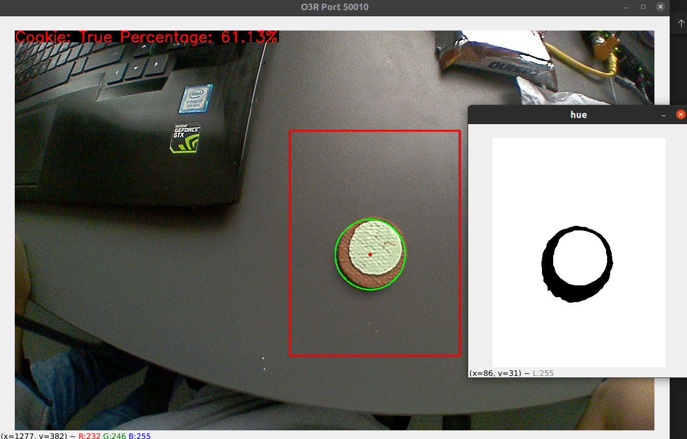
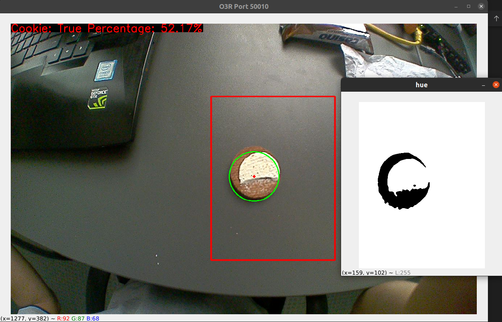
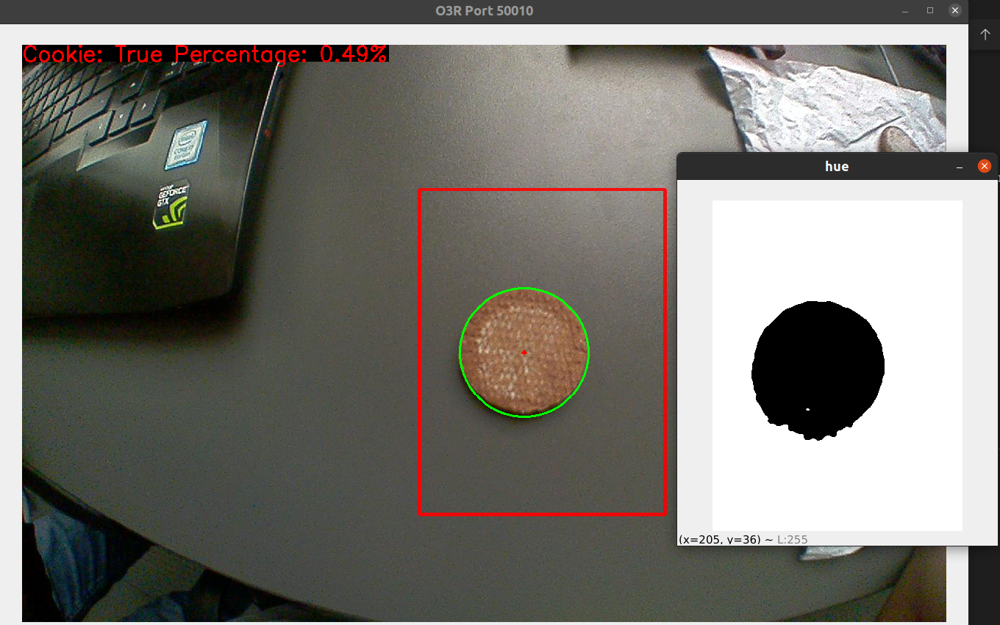
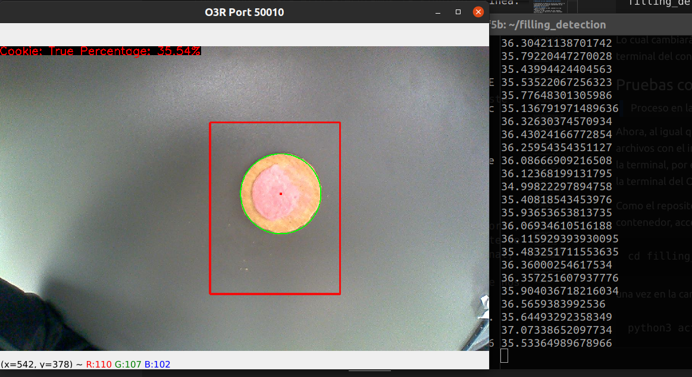

# Detección con una computadora de escritorio

A continuación se explica el uso de las cámaras y la visualización de la solución implementada en una computadora de escritorio.
## Pasos de conexión 
- Antes de alimentar el OVP, conectar la o las camaras a utilizar.
- Alimentar el OVP y despues de unos segundos verificar que los leds de las cámaras conectadas esten activados.
- Conectar el cable de ethernet a ETH0
- Colocar tu IP de ethernet a algo similar a la IP del OVP (por ejemplo: 192.168.0.100)

## Uso de las cámaras
- Correr el archivo `activate_cameras.py` en la carpeta filling detection para activar el uso de los puertos que se han conectado (modificar si es necesario).

``` 
python3 activate_cameras.py
```

Para comprobar que se está recibiendo imagen del OVP, correr en la terminal la siguiente linea

``` 
python3 viewer.py --pcic-port 50010 --image jpeg
```
> El pci-port va de 50010 (port0) a 50015 (port5), tener en cuenta que los puertos 2D son los puertos 0 y 2, siendo el resto los puertos 3D.

## Pruebas con detección de círculos (rellenas)

> Esta aplicación ha sido utilizada con Python 3.8.10 y con las librerías especificadas en `requirements.txt`

Para la detección del relleno de galletas circulares se ha utilizado técnicas de procesamiento de imágenes en el espacio de color HSV (Hue, Saturation, and Value), donde se ha trabajdo con la capa de saturación pues brinda mayor información y contraste entre la galleta y la crema de relleno.

Para revisar el funcionamiento correcto, correr la siguiente línea en la terminal (es necesario ubicarnos en el folder `filling_detection` para poder correr el archivo). 

``` 
python3 test_circle.py
```

El resultado muestra una imagen de prueba, donde se podrá observar el porcentaje de relleno encontrado.

Para la detección en tiempo real, correr la siguiente línea

``` 
python3 live_circle_test.py --pcic-port 50010 --image jpeg
```

Con ello, se podrá ver en video el funcionamiento y detección de galletas.

A continuación se muestran unas fotos y un video de demostración del funcionamiento.

<div class="row">
  <div class="column">
    
  </div>
  <div class="column">
    
  </div>
  <div class="column">
    
  </div>
</div>


# Detección con OVP800 mediante docker

Hasta ahora, todo el procesamiento a partir de las imágenes de la cámara han sido realizadas en una computadora de escritorio, cuya principal ventaja es la visulización. Ahora se desea implementar la misma solución en la unidad de video OVP800 construyendo una imagen de docker, escrita en el `Dockerfile`, con la solución propuesta. Entonces, seguimos los siguientes pasos.

## Construcción de la imagen de docker
> Proceso en computadora de escritorio

Para construir la imagen alojada en el `Dockerfile`, en la carpeta `filling_detection` corremos la siguiente línea.

``` 
docker build . -t filling_detection_image
```

Donde `filling detection_image` es el nombre de la imagen a construirse.

luego de la construcción, ejecutamos la línea
``` 
docker images
```
y veremos que la imagen figura en la lista mostrada.

Ahora guardamos la imagen en un archivo `.tar` para poder subirlo posteriormente en el OVP.

```
docker save filling_detection_image > fdi.tar
```


## Envio por SCP y conexión al OVP por SSH

En cuanto a hardware seguimos los [pasos de conexión](#pasos-de-conexión) ya mostrados.

> Proceso en computadora de escritorio

Ahora necesitamos enviar el archivo comprimido a la OVP utilizando scp.

```
scp fdi.tar oem@192.168.0.69:/home/oem
```

Ahora, utilizaremos la tecnología SSH para comandar la OVP mediante una terminal en nuestra computadora.

```
ssh oem@192.168.0.69
```

Si nos pide contraseña, tipeamos `oem`. Una vez hecho esto estaremos en la terminal del OVP y podemos ver que si ejecutamos `ls` en la terminal estará el archivo `fdi.tar` enviado previamente por scp.

## Carga y ejecución de la imagen docker en el OVP

> Proceso en la terminal del OVP

Antes de cargar la imagen en docker tenemos que asegurarnos que no hayan contenedores u otras imágenes que se han cargado anteriormente, por ello los eliminamos.

```
docker stop $(docker ps -a -q)
docker rm $(docker ps -a -q)
docker rmi $(docker images -a -q)
```

Ahora, para cargar la imagen, ejecutamos la siguiente línea.

```
docker load < fdi.tar
```

Una vez haya cargado, ejecutamos

```
docker images
```
y se debería mostrar la imagen `filling_detection_image` en la lista.

Ahora, procedemos a correr la imagen en un contenedor, para ello ejecutamos la siguiente línea.

```
docker run --name fdi_container -it filling_detection_image
```

Lo cual cambiará a una nueva terminal, que en este caso viene a ser la terminal del contendor `fdi_container`.

## Pruebas con detección de círculos 

> Proceso en la terminal del contenedor `fdi_container`

Ahora, al igual que en la computadora de escritorio, podremos correr los archivos con el inconveniente de que no tendremos visualización más que la terminal, por ello se han incluido scripts para el funcionamiento solo en la terminal del OVP y que nos permiten obtener la misma información.

Como el repositorio `filling_detection` ya está incluido en el contenedor, accedemos utilizando

```
cd filling_detection
```
una vez en la carpeta, activamos las cámaras conectadas con

``` 
python3 activate_cameras.py
```

Ahor podemos ejecutar la detección de galletas de forma contínua ejecutando.

``` 
python3 live_circle_test_terminal.py --pcic-port 50010 --image jpeg
```

Con ello, podremos observar la detección de galletas y el porcentaje en la terminal.

Por ejemplo, a continuación se muestra una comparación entre los resultados del proceso en la computadora, y los resultados en la OVP en la terminal, los cuales coinciden.




